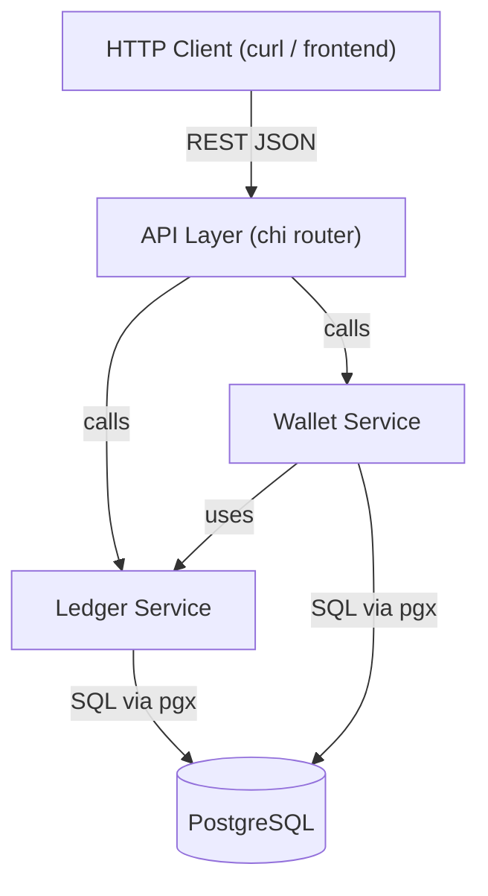

# Architecture Evaluation — General Ledger & Wallet Service

**Status:** Draft  
**Author:** Devshil  
**Last Updated:** 2026-08-20  
**Related Docs:** [Project Charter](file:///c:/Users/dell.000/Desktop/Ledger_wallet/docs/00-project-charter.md), [Architecture Design](file:///c:/Users/dell.000/Desktop/Ledger_wallet/docs/phase-4-design/architecture.md)

---

## 1. Objective / Purpose

This document records the **technical tradeoff decisions** made during architecture design. Each decision is documented with alternatives considered, pros/cons, and the final choice with rationale.

---

## 2. Decision Log

### Decision 1: Database Driver — `pgx/v5` vs `database/sql` + `lib/pq` vs GORM

| Option | Pros | Cons |
|---|---|---|
| **`pgx/v5`** ✅ | Pure Go, high performance, native PostgreSQL types, connection pooling built-in | Slightly more verbose than GORM for simple CRUD |
| `database/sql` + `lib/pq` | Standard library interface, widely documented | `lib/pq` is in maintenance mode, no native type support |
| GORM | Fast prototyping, auto-migrations | Hides SQL — unacceptable for a ledger where SQL visibility is a requirement |

**Decision:** `pgx/v5` — Performance, native types, and SQL visibility. The assignment explicitly says "do not hide ledger logic behind a heavy ORM."

---

### Decision 2: HTTP Router — `chi` vs `gin` vs `net/http` (Go 1.22+)

| Option | Pros | Cons |
|---|---|---|
| **`chi`** ✅ | stdlib-compatible, middleware support, URL params, zero deps | Less "magic" than Gin (this is a pro for review) |
| `gin` | Popular, fast, lots of middleware | Brings its own `gin.Context`, not stdlib-compatible |
| `net/http` (1.22+) | Zero dependencies, built-in pattern matching | No middleware chaining, more boilerplate |

**Decision:** `chi` — Idiomatic, stdlib-compatible, trivial to explain at review.

---

### Decision 3: Money Representation — `int64` Minor Units vs `shopspring/decimal` vs `float64`

| Option | Pros | Cons |
|---|---|---|
| **`int64` minor units** ✅ | Exact arithmetic, zero deps, fast | Must handle conversion at API boundary (display as "12.50") |
| `shopspring/decimal` | Arbitrary precision, string-safe | External dependency, heavier than needed for single-currency |
| `float64` | Built-in, easy | **NEVER** — IEEE 754 rounding errors break financial math |

**Decision:** `int64` minor units (cents). `1250` = $12.50. Documented in README and API spec.

> [!WARNING]
> **`float64` is permanently rejected.** This is a hard constraint from both the assignment and financial engineering best practices. Do not revisit this decision.

---

### Decision 4: Concurrency Strategy — Row Locking vs Serializable Isolation vs Optimistic Locking

| Option | Pros | Cons |
|---|---|---|
| **`SELECT … FOR UPDATE`** ✅ | Precise, locks only the rows we need, well-understood | Must manually manage lock scope |
| Serializable isolation level | Database handles all conflicts | Higher overhead, potential for serialization failures requiring retries |
| Optimistic locking (version column) | No locks held during read | Requires retry logic, complex for multi-account transactions |

**Decision:** `SELECT … FOR UPDATE` — Explicit, predictable, easy to explain. Lock the account row, check balance, insert entries, commit. One winner per race.

---

### Decision 5: Idempotency Strategy — DB Unique Constraint vs Application-Level Cache

| Option | Pros | Cons |
|---|---|---|
| **DB `UNIQUE` on `idempotency_key`** ✅ | Atomic, survives restarts, zero extra infrastructure | Requires handling `ON CONFLICT` in SQL |
| Application-level cache (Redis) | Fast lookups | Extra dependency, cache can expire/lose data, not durable |

**Decision:** `UNIQUE` constraint on `transactions.idempotency_key`. On conflict, return the existing transaction. No Redis dependency.

---

### Decision 6: Immutability Enforcement — DB Privileges vs Application Code vs Triggers

| Option | Pros | Cons |
|---|---|---|
| **`REVOKE UPDATE, DELETE`** ✅ | Enforced at database level — impossible to bypass from any client | Requires separate DB role management |
| Application code only | Simple | Any raw SQL connection could bypass it |
| Database triggers | Can log violations | Complex, performance overhead |

**Decision:** `REVOKE UPDATE, DELETE ON entries FROM PUBLIC` in migration SQL. Immutability is enforced by the database, not just by convention in Go code. Application code also has no update/delete paths as a secondary safeguard.

---

## 3. Architecture Summary

> [!TIP]
> Revisit this document whenever a major technical decision is made. Record the alternatives you rejected and why — this is gold during the review Q&A.
