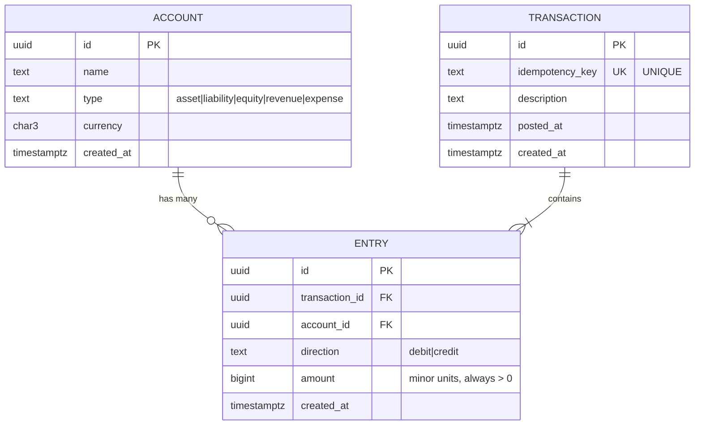

# Data Model — General Ledger & Wallet Service

**Status:** Draft  
**Author:** Devshil  
**Last Updated:** 2026-08-20  
**Related Docs:** [Functional Requirements](file:///c:/Users/dell.000/Desktop/Ledger_wallet/docs/phase-2-requirements/functional-requirements.md), [Architecture Design](file:///c:/Users/dell.000/Desktop/Ledger_wallet/docs/phase-4-design/architecture.md)

---

## 1. Objective / Purpose

Define the **domain entities**, their **attributes**, and their **relationships** for the Ledger & Wallet Service. This is the blueprint for the database schema and Go domain types.

---

## 2. Entity Relationship Diagram

---

## 3. Entity Details

### Account

| Field | Type | Constraints | Description |
|---|---|---|---|
| `id` | UUID | PK, auto-generated | Unique identifier |
| `name` | TEXT | NOT NULL | Human-readable account name (e.g., "Cash", "Wallet:alice") |
| `type` | TEXT | NOT NULL, CHECK IN (asset, liability, equity, revenue, expense) | One of the five account types |
| `currency` | CHAR(3) | NOT NULL | ISO 4217 currency code (e.g., "USD", "EUR") |
| `created_at` | TIMESTAMPTZ | NOT NULL, DEFAULT now() | When the account was created |

### Transaction

| Field | Type | Constraints | Description |
|---|---|---|---|
| `id` | UUID | PK, auto-generated | Unique identifier |
| `idempotency_key` | TEXT | UNIQUE, NOT NULL | Client-provided key to prevent duplicate transactions |
| `description` | TEXT | nullable | Human-readable description of the transaction |
| `posted_at` | TIMESTAMPTZ | NOT NULL, DEFAULT now() | When the transaction was logically posted |
| `created_at` | TIMESTAMPTZ | NOT NULL, DEFAULT now() | When the row was inserted |

### Entry

| Field | Type | Constraints | Description |
|---|---|---|---|
| `id` | UUID | PK, auto-generated | Unique identifier |
| `transaction_id` | UUID | FK → transactions.id, NOT NULL | Parent transaction |
| `account_id` | UUID | FK → accounts.id, NOT NULL | Which account this entry affects |
| `direction` | TEXT | NOT NULL, CHECK IN (debit, credit) | Whether this entry is a debit or credit |
| `amount` | BIGINT | NOT NULL, CHECK > 0 | Amount in minor units (always positive; direction determines sign) |
| `created_at` | TIMESTAMPTZ | NOT NULL, DEFAULT now() | When the entry was created |

> [!IMPORTANT]
> Entries are **immutable**. The `entries` table has `REVOKE UPDATE, DELETE` at the database level. This is enforced by schema, not by application convention.

---

## 4. Key Design Decisions

### Why `amount` is always positive
The `direction` field (debit/credit) carries the sign semantics. Storing `amount` as always-positive avoids ambiguity and makes balance calculation a simple `SUM(CASE WHEN direction = 'debit' THEN amount ELSE 0 END)` pattern.

### Why UUIDs instead of auto-increment
- UUIDs are safe for distributed systems (even though this is a single-node service now)
- No information leakage (auto-increment IDs reveal volume)
- Consistent with production fintech patterns

### Why `idempotency_key` is on `transactions`, not on `entries`
Idempotency is a property of the **operation** (the transaction), not individual line items. One key → one transaction → N entries.

---

## 5. Indexes (Planned)

| Table | Columns | Type | Rationale |
|---|---|---|---|
| `entries` | `account_id, created_at` | B-tree | Fast balance queries and historical balance lookups |
| `entries` | `transaction_id` | B-tree | Fast join back to transaction from entry |
| `transactions` | `idempotency_key` | Unique B-tree | Idempotency constraint enforcement |
