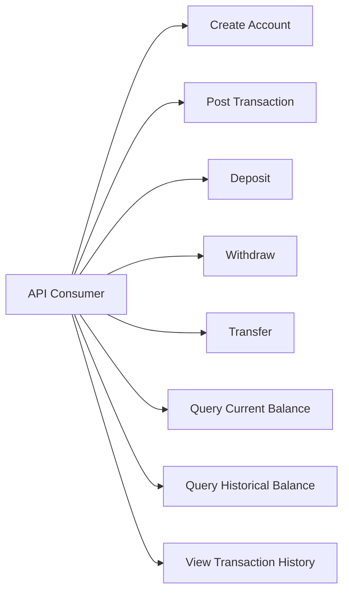
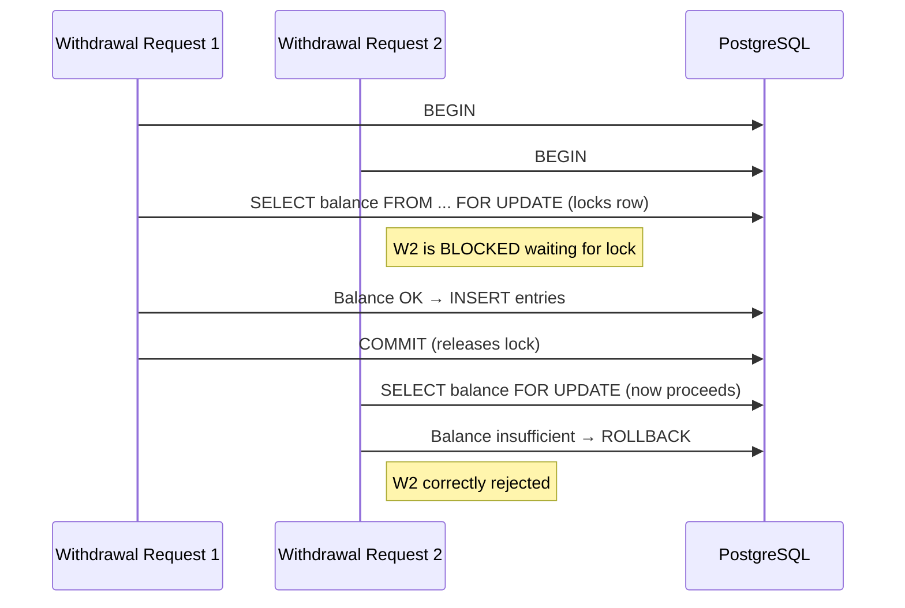

# Use Cases — General Ledger & Wallet Service

**Status:** Draft  
**Author:** Devshil  
**Last Updated:** 2026-08-20  
**Related Docs:** [Functional Requirements](file:///c:/Users/dell.000/Desktop/Ledger_wallet/docs/phase-2-requirements/functional-requirements.md), [Data Model](file:///c:/Users/dell.000/Desktop/Ledger_wallet/docs/phase-3-analysis/data-model.md)

---

## 1. Objective / Purpose

Define the **user workflows** (use cases) for the Ledger & Wallet Service. Each use case describes an actor, preconditions, the happy path, and failure scenarios.

---

## 2. Use Case Diagram

---

## 3. Use Cases

### UC-1: Create Account

| Field | Value |
|---|---|
| **Actor** | API Consumer |
| **Precondition** | None |
| **Happy Path** | Consumer sends `POST /v1/accounts` with name, type, currency → system creates account → returns 201 with account details |
| **Failure** | Invalid type → 400; missing fields → 400 |
| **Post-condition** | Account exists in `accounts` table with zero balance |

---

### UC-2: Post Transaction (Raw Double-Entry)

| Field | Value |
|---|---|
| **Actor** | API Consumer |
| **Precondition** | All referenced accounts exist |
| **Happy Path** | Consumer sends `POST /v1/transactions` with idempotency_key, description, and entries array → system validates debits = credits → inserts transaction + entries atomically → returns 201 |
| **Failure 1** | Debits ≠ credits → 422, no entries written |
| **Failure 2** | Account ID not found → 400 |
| **Failure 3** | Duplicate idempotency_key → 200, returns existing transaction |
| **Post-condition** | Transaction and entries immutably stored |

---

### UC-3: Deposit

| Field | Value |
|---|---|
| **Actor** | API Consumer |
| **Precondition** | Wallet account (Liability) and Cash account (Asset) exist |
| **Happy Path** | Consumer sends `POST /v1/wallets/deposit` with wallet_id, amount, idempotency_key → system debits Cash, credits Wallet → returns 201 |
| **Failure** | Duplicate idempotency_key → 200, returns existing result |
| **Post-condition** | Wallet balance increased; Cash balance increased |

---

### UC-4: Withdraw

| Field | Value |
|---|---|
| **Actor** | API Consumer |
| **Precondition** | Wallet has sufficient balance |
| **Happy Path** | Consumer sends `POST /v1/wallets/withdraw` with wallet_id, amount, idempotency_key → system debits Wallet, credits Cash → returns 201 |
| **Failure 1** | Insufficient balance → 422, no entries written |
| **Failure 2** | Duplicate idempotency_key → 200, returns existing result |
| **Post-condition** | Wallet balance decreased; Cash balance decreased |

---

### UC-5: Transfer

| Field | Value |
|---|---|
| **Actor** | API Consumer |
| **Precondition** | Source wallet has sufficient balance; both wallets exist |
| **Happy Path** | Consumer sends `POST /v1/wallets/transfer` with source_wallet_id, destination_wallet_id, amount, idempotency_key → system debits source, credits destination → returns 201 |
| **Failure 1** | Insufficient source balance → 422 |
| **Failure 2** | Source = destination → 400 |
| **Failure 3** | Duplicate idempotency_key → 200, returns existing result |
| **Post-condition** | Source balance decreased; Destination balance increased; total across both unchanged |

---

### UC-6: Query Current Balance

| Field | Value |
|---|---|
| **Actor** | API Consumer |
| **Precondition** | Account exists |
| **Happy Path** | Consumer sends `GET /v1/accounts/:id/balance` → system sums all entries for that account applying debit/credit rules → returns balance |
| **Post-condition** | Read-only operation; no state change |

---

### UC-7: Query Historical Balance

| Field | Value |
|---|---|
| **Actor** | API Consumer |
| **Precondition** | Account exists |
| **Happy Path** | Consumer sends `GET /v1/accounts/:id/balance?at=2026-08-15T12:00:00Z` → system sums entries where `posted_at <= timestamp` → returns balance at that point in time |
| **Failure** | Invalid timestamp format → 400 |
| **Post-condition** | Read-only operation; no state change |

---

### UC-8: View Transaction History

| Field | Value |
|---|---|
| **Actor** | API Consumer |
| **Precondition** | Account exists |
| **Happy Path** | Consumer sends `GET /v1/accounts/:id/transactions` → system returns all transactions that have entries involving this account, ordered by `posted_at` descending |
| **Post-condition** | Read-only operation; no state change |

---

## 4. Concurrency Scenario: Simultaneous Withdrawals

> [!IMPORTANT]
> The `SELECT … FOR UPDATE` ensures only one concurrent request can read and modify a wallet's balance at a time. The second request sees the **updated** balance after the first commits.
