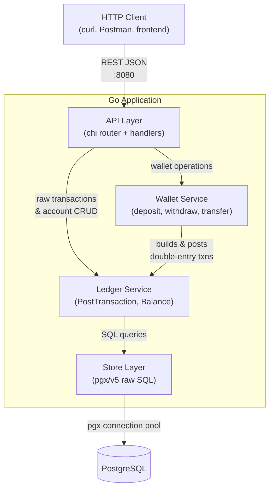
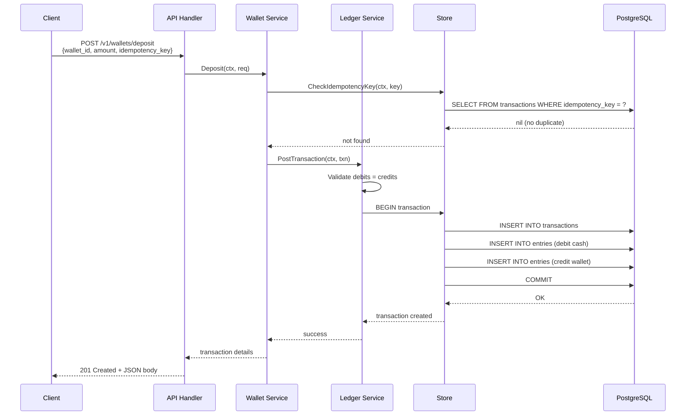

# Architecture — General Ledger & Wallet Service

**Status:** Draft  
**Author:** Devshil  
**Last Updated:** 2026-08-20  
**Related Docs:** [Architecture Evaluation](file:///c:/Users/dell.000/Desktop/Ledger_wallet/docs/architecture-evaluation.md), [Data Model](file:///c:/Users/dell.000/Desktop/Ledger_wallet/docs/phase-3-analysis/data-model.md)

---

## 1. Objective / Purpose

Define the **system architecture** for the Ledger & Wallet Service — layers, dependencies, data flow, and the separation of concerns between the ledger engine and the wallet API.

---

## 2. High-Level Architecture



---

## 3. Layer Responsibilities

| Layer | Package | Responsibility | Dependencies |
|---|---|---|---|
| **Domain** | `internal/domain` | Pure Go types — `Account`, `Transaction`, `Entry`, `AccountType` constants, `Amount` type | None (zero imports) |
| **Store** | `internal/store` | SQL queries via `pgx/v5` — CRUD operations, balance aggregation, idempotency checks | `domain`, `pgx` |
| **Ledger Service** | `internal/ledger` | Core business logic — validate debit=credit, post transactions atomically, compute balances | `domain`, `store` |
| **Wallet Service** | `internal/wallet` | High-level wallet operations — deposit/withdraw/transfer, overdraft checks, idempotency | `domain`, `ledger` |
| **API** | `internal/api` | HTTP handlers, request parsing, response formatting, routing | `domain`, `ledger`, `wallet` |
| **Main** | `cmd/server` | Entry point — wires dependencies, starts HTTP server | All |

> [!IMPORTANT]
> **Dependency rule:** Dependencies flow **downward** only. `domain` depends on nothing. `store` depends on `domain`. `ledger` depends on `domain` + `store`. `wallet` depends on `domain` + `ledger`. `api` depends on all services. Nothing depends on `api`.

---

## 4. Data Flow: Wallet Deposit



---

## 5. Folder Structure

```text
ledger-wallet/
├── cmd/
│   └── server/
│       └── main.go                  # Entry point; dependency injection
├── internal/
│   ├── domain/                      # Pure types — zero external dependencies
│   │   ├── account.go               # Account struct, AccountType enum
│   │   ├── transaction.go           # Transaction, Entry structs
│   │   └── money.go                 # Amount type alias (int64 minor units)
│   ├── store/                       # PostgreSQL persistence (pgx/v5)
│   │   ├── store.go                 # Store struct, constructor, pool
│   │   ├── account_store.go         # Account CRUD
│   │   ├── transaction_store.go     # Transaction + Entry inserts
│   │   └── balance_store.go         # Balance aggregation queries
│   ├── ledger/                      # Core double-entry engine
│   │   ├── service.go               # PostTransaction, GetBalance, GetHistoricalBalance
│   │   └── service_test.go          # Invariant tests
│   ├── wallet/                      # Wallet operations layer
│   │   ├── service.go               # Deposit, Withdraw, Transfer
│   │   └── service_test.go          # Overdraft, idempotency, concurrency tests
│   └── api/                         # HTTP handlers & routing
│       ├── router.go                # chi router setup + middleware
│       ├── accounts_handler.go      # POST /v1/accounts, GET /v1/accounts/:id
│       ├── transactions_handler.go  # POST /v1/transactions
│       ├── wallet_handler.go        # POST /v1/wallets/{deposit,withdraw,transfer}
│       └── balance_handler.go       # GET /v1/accounts/:id/balance
├── migrations/
│   ├── 000001_create_accounts.up.sql
│   ├── 000001_create_accounts.down.sql
│   ├── 000002_create_transactions.up.sql
│   ├── 000002_create_transactions.down.sql
│   ├── 000003_create_entries.up.sql
│   └── 000003_create_entries.down.sql
├── docs/                            # This documentation folder
├── docker-compose.yml
├── Dockerfile
├── go.mod
├── go.sum
└── README.md
```

---

## 6. Cross-Cutting Concerns

| Concern | Strategy |
|---|---|
| **Error handling** | Typed errors in domain package; handlers map to HTTP status codes |
| **Logging** | `log/slog` structured logger (Go 1.21+) |
| **Configuration** | Environment variables loaded in `main.go` |
| **Database connection** | `pgxpool.Pool` — connection pooling with configurable limits |
| **Graceful shutdown** | `os.Signal` listener → `server.Shutdown(ctx)` → pool close |
