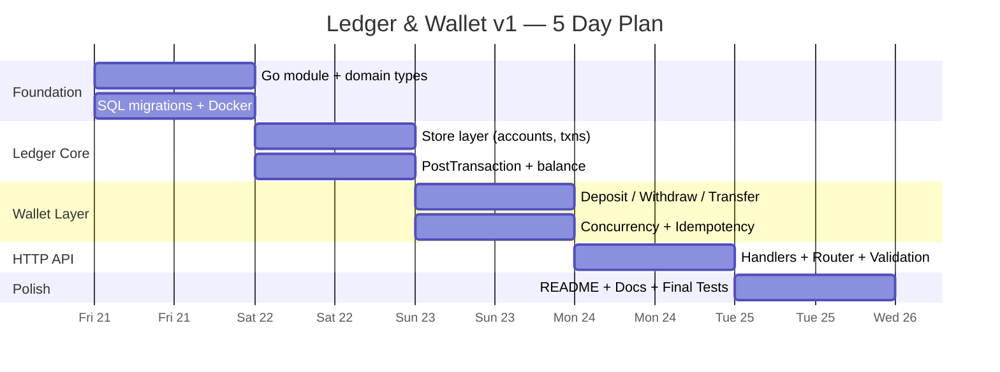

# Roadmap — General Ledger & Wallet Service

**Status:** Draft  
**Author:** Devshil  
**Last Updated:** 2026-08-20  
**Related Docs:** [Project Charter](file:///c:/Users/dell.000/Desktop/Ledger_wallet/docs/00-project-charter.md), [v2 Backlog](file:///c:/Users/dell.000/Desktop/Ledger_wallet/docs/v2-backlog.md)

---

## 1. Objective / Purpose

This document tracks the high-level vision and release milestones for the Ledger & Wallet Service. It distinguishes between what is being built **now** (v1) and what could be built **later** (v2+).

---

## 2. v1 — Assignment Delivery (5 Working Days)

**Goal:** A correct, tested, and documented double-entry ledger with wallet operations.

| Milestone | Target Day | Key Deliverables |
|---|---|---|
| **M1: Foundation** | Day 1 | Go module, domain types, SQL migrations, Docker setup |
| **M2: Ledger Core** | Day 2 | Account CRUD, PostTransaction with invariant checks, balance queries |
| **M3: Wallet Layer** | Day 3 | Deposit, Withdraw, Transfer with concurrency + idempotency |
| **M4: HTTP API** | Day 4 | All REST endpoints wired, request validation, error codes |
| **M5: Docs & Polish** | Day 5 | README, accounting concepts doc, integration tests, commit history cleanup |

### v1 Feature Scope

| Feature | In v1? |
|---|---|
| Five account types (Asset, Liability, Equity, Revenue, Expense) | ✅ |
| Double-entry transactions with debit=credit validation | ✅ |
| Immutable ledger (no UPDATE/DELETE) | ✅ |
| Current balance query (derived from entries) | ✅ |
| Historical balance query (at a given timestamp) | ✅ |
| Wallet deposit / withdraw / transfer | ✅ |
| Idempotency keys on wallet operations | ✅ |
| Concurrency-safe withdrawals (row locking) | ✅ |
| Multi-currency transactions | ❌ (v2) |
| Audit log / event sourcing | ❌ (v2) |
| gRPC API | ❌ (v2) |
| Admin dashboard UI | ❌ (v2) |

---

## 3. v2+ — Post-Assignment Ideas

See [v2-backlog.md](file:///c:/Users/dell.000/Desktop/Ledger_wallet/docs/v2-backlog.md) for the full list of features deferred beyond v1.

---

## 4. Timeline Visualization

